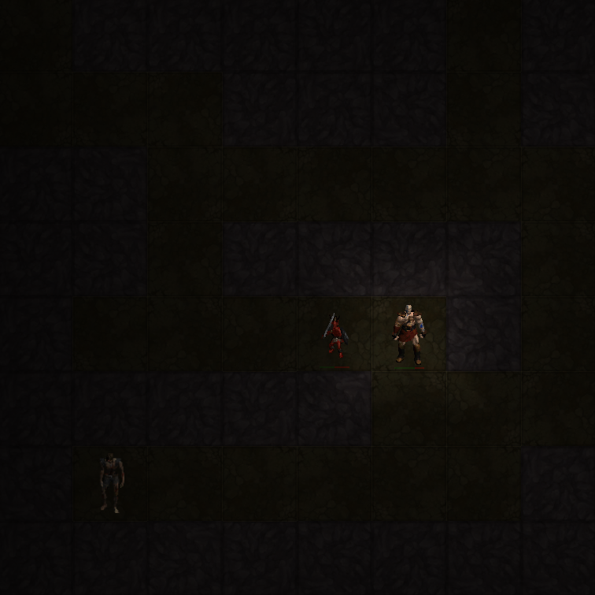

# The Den of Evil - browser game
"Shadowy creatures from beyond the grave lurks in these caves. If you are sincere about helping, destroy the foul beasts..."  
  

## To play
1) git clone https://github.com/DanielZambelli/den-of-evil.git
2) cd den-of-evil  
2) open index.html

## Dev notes
The game engine works by keeping track of the current state of the game, detecting user input, calculating the next state e.g. play position before visualising the game state in the browser.  

## Tech Stack
HTML, CSS, JavaScript
